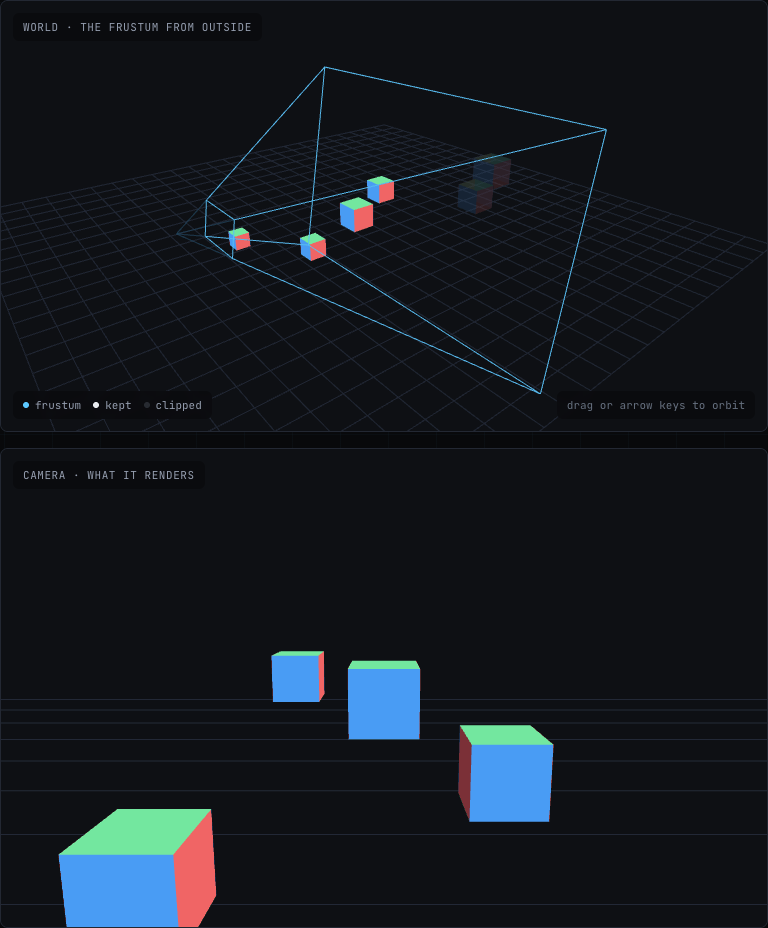

# Render Quest

**Learn graphics by moving the numbers.**

[](https://github.com/alibad/render-quest/actions/workflows/ci.yml)


A recording, because GitHub cannot run WebGL. On the site it is live — you drag that
slider yourself, and the matrix, the geometry and the pixels change together.

**[Open the site](https://www.render-quest.com)** ·
**[Start at Lab 1](https://www.render-quest.com/labs/transform)** ·
**[Every lab](https://www.render-quest.com/labs)**

10 labs · 61 glossary terms · 37 resources · 0 stock images · no account, no
analytics, no cookies.

It is for anyone who can write JavaScript and has never written a shader. No linear
algebra assumed.

## Why

A transform is not a table of sixteen numbers — it is a motion, and you cannot see a
motion on a static page. So each lab is an essay with figures embedded in it — a
figure being one canvas, one control and a caption — and the full instrument, every
control at once, at the foot of the page. The prose between the figures runs
900–1,900 words a lab; the captions are on top of that.

## What a lab is

The essay runs down the middle of the page. Inside it are figures: one canvas, one
control, one caption, each making a single point you can take hold of and move.



At the foot of the page the same scene comes back as the whole instrument: every
control at once, named presets, a live numeric readout, the shader source it actually
compiled, and a link that carries the current state — so a configuration that makes a
point can be handed to someone.


## The labs

In sequence. Each one assumes the ideas of the one before it, and says so.

| # | Lab | API | What you come away with |
| --- | --- | --- | --- |
| 1 | [The Model Matrix](https://www.render-quest.com/labs/transform) | WebGL | Why a matrix chain reads right to left, and why the columns are the object's own axes. |
| 2 | [Projection & the Frustum](https://www.render-quest.com/labs/projection) | WebGL | What the perspective divide actually does, and why near and far are a hard clip rather than a fade. |
| 3 | [Coordinate Spaces](https://www.render-quest.com/labs/pipeline) | WebGL | Where each matrix in the chain hands over to the next, and what the GPU does between them. |
| 4 | [Light & Normals](https://www.render-quest.com/labs/shading) | WebGL | Why normals need the inverse-transpose, and what separates flat, Gouraud and Phong. |
| 5 | [Textures & Sampling](https://www.render-quest.com/labs/textures) | WebGL | Why a texture looks wrong at a distance, and what mipmapping is really trading away. |
| 6 | [Compute & Particles](https://www.render-quest.com/labs/compute) | WebGPU | What a compute shader is for, and the kind of problem that leaves WebGL behind entirely. |
| 7 | [Draw Calls & Instancing](https://www.render-quest.com/labs/instancing) | WebGPU | Why the number of draw calls matters more than the number of triangles. |
| 8 | [Colour & Gamma](https://www.render-quest.com/labs/colour) | WebGL | Why lighting maths done on sRGB numbers is wrong, and why the mistake looks like a style rather than a bug. |
| 9 | [Depth & Transparency](https://www.render-quest.com/labs/depth) | WebGL | That depth precision is set by the near plane rather than the model, and that the depth buffer cannot answer the question transparency asks. |
| 10 | [Write a Shader](https://www.render-quest.com/labs/shader) | WebGL | That a shader is a function from a pixel coordinate to a colour, and that the errors are readable once something shows them to you. |

Eight of the ten run anywhere WebGL does. Labs 6 and 7 need WebGPU — Chrome, Edge or
Safari 26 and later — and say so on a card if the browser has not got it, rather than
falling back to something that is not what the lab is about.

Around 15,000 words of essay in total, not counting the figure captions.

Also on the site: four [technology guides](https://www.render-quest.com/tech) writing
the same two reference scenes — a cosine-palette plasma and a lit, spinning cube — in
WebGL, WebGPU, Three.js and vgpu (Vercel Labs' minimal WebGPU library). Two of the
four run on the page. Three.js and vgpu are not dependencies of this site, so their
pages show the code and say plainly that it is not running, which is the only option
open to a site that counts its stock images on the front page. Alongside them: a
[chooser](https://www.render-quest.com/tech/choose) that answers "which should I
use"; a 61-term glossary; and a curated
[reading path](https://www.render-quest.com/learn) through other people's material.

## Running it

```bash
npm install
npm run dev
```

Node 24 (`.nvmrc`, and `engines.node` in `package.json`), matching what Vercel
deploys with.

## Tests

```bash
npm test         # twelve suites, no browser — runs as part of npm run build
```

`npm test` covers the matrix core and frustum derivation (composition order, the
perspective divide, near/far into NDC, `lookAt` orthonormality, inverse round-trips,
the clip test), the content registries, the URL codec, the chooser, the shaders as
strings — every uniform the TypeScript asks for must exist in the shader it is
compiled against, which nothing else here catches — the canvas palette against the CSS
tokens it mirrors, so a scene cannot be drawn in a colour the page around it does not
use — and the prose that quotes those registries: this README and the line counts on
the technology pages, each checked against the data it claims to be describing.

The rendering suite is three commands rather than one, because it needs a browser and
a production build:

```bash
npx playwright install chromium
npx next build
npm run test:render
```

It starts a production server on port 3111 itself, unless `SMOKE_BASE_URL` points it
at one already running. CI runs these three steps too, with one difference: it installs
Chromium as `npx playwright install --with-deps chromium`, which also installs the
system libraries a bare Ubuntu runner is missing. On your own machine you want the
command above, without `--with-deps`.

`npm run test:render` loads every route in Chromium and checks that each canvas
actually drew something, that no lab is showing its own failure card, that nothing
logged an error, that no page scrolls sideways at 375px, and that no grid ends on a
half-empty row. It reads the canvas in the page rather than screenshotting it.
Screenshotting was tried first and was wrong twice over under the flags this test
runs with: the WebGL content did not appear in the capture at all, and the site's
blueprint-grid background showed through the transparent canvas and measured as
detail. The first version of this test passed while every lab was blank.

## How it is built

Raw WebGL and WebGPU — no scene graph, no rendering framework. The plumbing a
framework hides (contexts, buffers, attribute pointers, the perspective divide, bind
group layouts) is the actual subject, so none of it is hidden. Three runtime
dependencies: `next`, `react` and `react-dom`. No graphics library of any kind.

```
lib/math/          mat4 (column-major, GPU-ready) and vec3
lib/gl/            program compilation, geometry, shared scene kit, frustum derivation
lib/labs.ts        the lab registry — order, prerequisites, which API and why
components/lab/    GLCanvas render loop, controls, matrix readout, layout, URL state
components/labs/   an essay and an instrument per lab
components/tech/   the WebGL and WebGPU reference scenes, and the chooser
test/              the suites above
todo/              a dated changelog per working day
```

Nothing on the site is a stock or pre-rendered image. The home page hero is the
projection lab with its controls removed, running live in your browser.

## Licence

The code is MIT — see [`LICENSE`](LICENSE), which is the plain MIT text and nothing
else, so that it is recognised as such. The writing is CC BY 4.0 — see
[`LICENSE-CONTENT`](LICENSE-CONTENT): the lab essays, the glossary, the guide copy
and the figures the words are written around. Teach with them, quote them, translate
them; say where they came from. Several files hold both, and the split runs through
them: the words are CC BY 4.0, the code around the words is MIT.

## Feedback

Open an issue for a lab that renders wrong on your GPU or your browser, an
explanation that does not land, a claim that is wrong, or a technology guide that has
gone stale. There are no analytics here, so nothing else reports back — one message
counts for more than it would elsewhere. [`CONTRIBUTING.md`](CONTRIBUTING.md) says
what a useful report contains, and the
[roadmap](https://www.render-quest.com/roadmap) says what is deliberately not being
built, so you can see whether a gap is an omission or a decision.

Built by Ali Bader Eddin.
